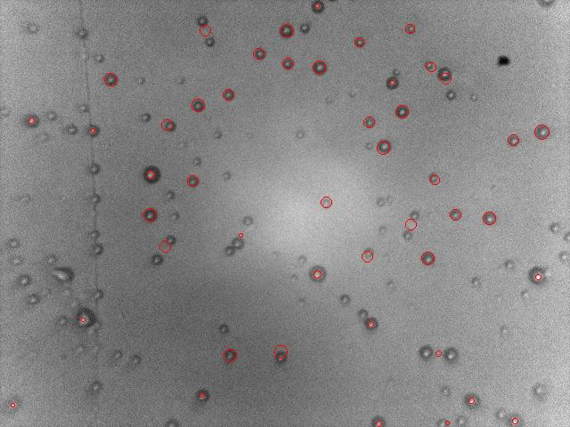

# Sensorware
"Firmware" for particle sensor based on Raspberry Pi.

Sensor's PiCamera is placed to view stream of some liquid that contains the particles. 

The firmware:
1.	Allows liquid to flow or stop using vents (via GPIO output);
2.	Captures the image of the stream using PiCamera with LED highlight;
3.	Detects blobs on the image using opencv's SimpleBlobDetector;
4.  Calculates blob features, like size/area;
5.  Reports findings to other devices via CAN bus.

Example image:
